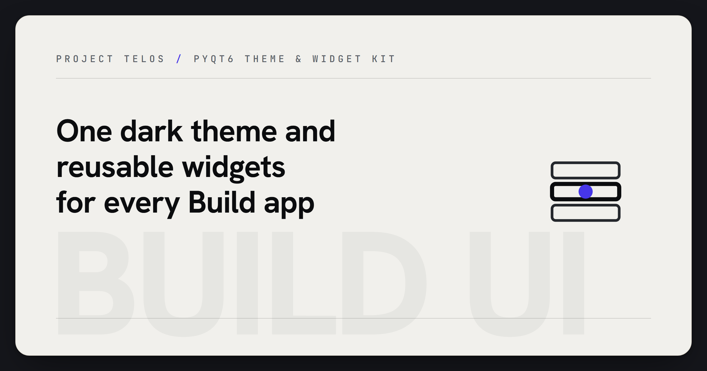

<p align="center">
  
</p>
<!-- Project mark: docs/brand/build-ui-mark.svg -->

# Build UI

> Shared PyQt6 theme and reusable widget library for the Build ecosystem — one
> consistent look across every Build application.

[Project Telos](https://harperz9.github.io) | [gather](https://github.com/HarperZ9/gather) | [crucible](https://github.com/HarperZ9/crucible) | [index](https://github.com/HarperZ9/index) | [forum](https://github.com/HarperZ9/forum) | [telos](https://github.com/HarperZ9/telos) | [emet](https://github.com/HarperZ9/emet) | [buildlang](https://github.com/HarperZ9/buildlang)

[](https://github.com/HarperZ9/build-ui/actions/workflows/ci.yml)


[](LICENSE)

Build UI provides a single source of truth for color and Qt stylesheet
generation, plus a small set of pre-styled widgets, so every application in
the Build family (Calibrate Pro, Build Color, Build Finance, Build Oracle,
Build Engine) renders consistently instead of re-implementing chrome.

## Quick Start

```bash
pip install build-ui
```

```python
from build_ui.theme import C, STYLE
from build_ui.widgets import Card, Heading, Sidebar

app.setStyleSheet(STYLE)

card, layout = Card.with_layout()
layout.addWidget(Heading("Dashboard", level=1))
```

## Features

- **Theme (`theme.py`)** — `C`, a class of hex color constants (background,
  surface, border, text, accent, semantic colors); `create_stylesheet(c=None)`,
  which renders a full Qt stylesheet from any color class; `STYLE`, the
  pre-rendered stylesheet for the default palette.
- **Widgets (`widgets.py`)** — `Card`, `StatusDot`, `Heading`, `Stat`,
  `NavButton`, `Sidebar`, `ToastNotification`: reusable `QWidget` subclasses
  that read their colors from `theme.C`.

## Python API

```python
from build_ui.theme import C, STYLE, create_stylesheet
from build_ui.widgets import Card, Heading, Stat, NavButton, Sidebar, StatusDot, ToastNotification

# Apply the shared stylesheet to a QApplication
app.setStyleSheet(STYLE)

# Build a themed variant by overriding constants
class DarkC(C):
    BG = "#161616"

dark_style = create_stylesheet(DarkC)

# Compose widgets
sidebar = Sidebar(["Dashboard", "Settings"], app_name="My App")
stat = Stat("Uptime", "99.9%")
toast = ToastNotification("Saved", level="success")
```

## Architecture

```
build_ui/
  theme.py     Color constants (C) + create_stylesheet() Qt stylesheet generator
  widgets.py   Card, StatusDot, Heading, Stat, NavButton, Sidebar, ToastNotification
```

See [ARCHITECTURE.md](ARCHITECTURE.md) for module responsibilities and design
decisions, and [USAGE.md](USAGE.md) for a full worked walkthrough.

## Installation

```bash
pip install build-ui
```

Requires Python 3.10+ and PyQt6 (installed automatically).

## License

Copyright (c) 2022-2026 Zain Dana Harper. All rights reserved. Build UI is
released under the FSL-1.1-MIT: the source is
available so you can read it, run it, and build on it, while competing
commercial use is reserved to the Licensor to fund continued development. See
[LICENSE](LICENSE).
